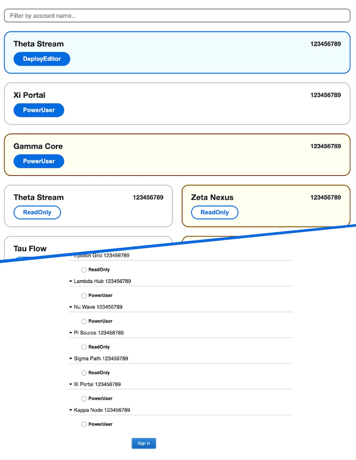

# AWS SAML Sign-In Beautifier

A browser extension that improves the AWS SAML sign-in page, especially for users managing many accounts. It enhances readability, speeds up role selection, and adds features like filtering, keyboard navigation, and dark mode.

AWS’s default SAML sign-in page can be slow and frustrating, especially when you have access to dozens (or hundreds) of roles.

## Key Features

- **One-Click Sign-In** – Instantly sign in by clicking a role button
- **Account Filter** – Quickly narrow down roles with a search input
- **Keyboard Navigation** – Navigate and select roles without touching your mouse
- **Favorite Accounts** – Pin your most-used roles to the top
- **Smart Text Cleanup** – Automatically remove clutter from button labels
- **Role Highlighting** – Highlight important roles based on your patterns
- **Visual Account Categories** – Use color to differentiate production and non-prod
- **Dark Mode** – Looks great in dark environments and matches your OS theme

## Get the Extension

- [Chrome Web Store](https://chromewebstore.google.com/detail/aws-saml-signin-beautifie/kcokjencejoakomoobgbahgfhchohfmp)
- [Firefox Add-ons](https://addons.mozilla.org/en-US/firefox/addon/aws-saml-sign-in-beautifier/)
- Edge Coming Soon

---

_This extension is not affiliated with or endorsed by Amazon Web Services._
